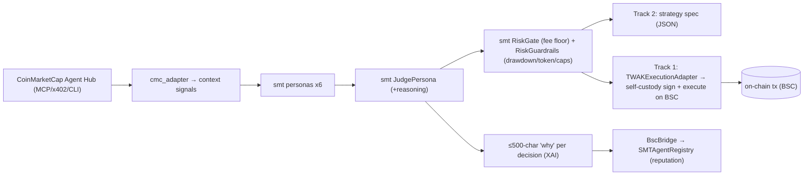

# BNB Hack: AI Trading Agent — Smart Money Trading

**Hackathon:** BNB Hack: AI Trading Agent Edition (CoinMarketCap × Trust Wallet × BNB Chain) ·
$36,000 · build window Jun 3–21 · **submit by 2026-06-21** · live-trading window Jun 22–28.
**Submission repo:** https://github.com/JannetEkka/smt-bnb
**Why this one fits best:** it's an *AI trading agent* hackathon — SMT's brain maps directly, and
the live window coincides with our fast-lane PROFITABLE target (Jun 28).

---

## What we ship (both tracks; Track 2 first)

### Track 2 — Strategy Skills ($6k, no execution) ← drop-in
A **CoinMarketCap-data Skill** that turns market state into a backtestable strategy spec — exactly
our regime + multi-persona scoring, authored as an LLM Skill. Deliverable is a structured, auditable
strategy spec (not a live trader). **Lowest effort, highest-probability placement.** → `strategy_skill.py`.

### Track 1 — Autonomous Trading Agents ($24k, live PnL on BSC)
The SMT brain reads CMC data, decides, and a **Trust Wallet Agent Kit (TWAK)** adapter signs +
executes on BSC, within hard risk guardrails (un-disableable fee floor + 30% drawdown DQ cap +
per-trade/daily caps + the contest's eligible-token allowlist + slippage). On-chain registration
before Jun 22. Targets the **Best Use of TWAK** special prize via genuinely hands-off, self-custodial
execution. → `twak_adapter.py`.

---

## Components reused from `smt/` (imported, not copied)

| Need | Reused from main repo | Folder-local (custom) |
|---|---|---|
| Persona votes | `smt.personas.{flow,technical,whale,onchain,sentiment,regime}` | — |
| Aggregation + "why" | `smt.personas.judge.JudgePersona` | ≤500-char reason formatter |
| Risk / fee floor | `smt.core.risk.RiskGate` | `RiskGuardrails` (drawdown/token/per-trade/daily) |
| Execution intent | `smt.core.trade_plan.TradePlan` | `TWAKExecutionAdapter` (BSC self-custody) |
| Market data | — | `cmc_adapter` → `context.*` signal dicts |
| Identity / reputation | — | `SMTAgentRegistry.sol` + `BscBridge` (`onchain.py`) |

> `cmc_adapter` populates the same `context["flow_signal"]/["technical_signal"]/["regime"]/…` dicts the
> personas already read, so the brain is untouched. `TWAKExecutionAdapter` implements the same
> `place/close` shape as `smt.core.execution.ExecutionClient` — a sibling adapter, not a fork.

---

## System design



## Verify it yourself (no API keys)
```bash
pip install pytest
pytest -q tests/test_bnb_bridge_smoke.py            # 10 green: encoders, CMC schema, spec, guardrails
python3 bnb/agent.py                                # offline demo: CMC → spec → Track-1 guardrail dry-run
```
(In the main repo the adapter is `hackathons/bnb-ai-trading-agent/`; in the `smt-bnb` submission repo it's top-level `bnb/`.)

## Eligible-token honesty note
The contest's eligible BEP-20 set (`twak_adapter.ELIGIBLE_TOKENS`, 149 tokens) **excludes BTC/BNB/SOL**,
so SMT's *tradeable* subset on BSC is **{ETH, XRP, DOGE, ADA, LTC}**; we still SCORE all 8 pairs and the
allowlist guardrail blocks any off-list order (it "wouldn't count").

## BUIDL submission
See `../BUIDL.md` (paste-ready, repo root) + the **shared blocks** in the repo-root README. Lead with "live PnL with a
drawdown cap" (Track 1) and "backtestable CMC Skill" (Track 2); name CMC Agent Hub + Trust Wallet Agent
Kit + BNB AI Agent SDK as the integration surfaces; on-chain proof = agent wallet address + BSC tx hash.

## Build status

**Built + tested this session** (`pytest tests/test_bnb_bridge_smoke.py` — 10 green; full suite 207):
- ✅ `cmc_adapter.py` — CMC → SMT context dicts (FLOW = transparent volume-momentum proxy; OHLCV→klines;
  F&G; funding). Pure + offline; `CMCClient` degrades to None without a key.
- ✅ `strategy_skill.py` — Track 2: personas → Judge → backtestable spec (entry/exit/risk + ≤500-char why).
- ✅ `twak_adapter.py` — Track 1: `TWAKExecutionAdapter` (place/close) + `RiskGuardrails` (fee floor +
  30% drawdown DQ + per-trade/daily caps + token allowlist + slippage). Offline = guardrail-checked dry-run.
- ✅ `onchain.py` — `BscBridge` over `SMTAgentRegistry.sol`; graceful-degrade (no web3/RPC → signal-only).
- ✅ `agent.py` — runner (offline demo). `agent_card.json` · `hardhat.config.js` + `scripts/deploy.js` +
  `package.json` (BSC testnet 97 / mainnet 56 deploy + Etherscan-V2 verify).

**Remaining — operator:**
- [ ] 👤 Deploy + verify `SMTAgentRegistry` on BSC testnet (tBNB faucet); set the address in
  `agent_card.json` + `smt_world/app.js`.
- [ ] 👤 Register the agent wallet on-chain before Jun 22 (`twak compete register` / MCP `competition_register`).
- [ ] 👤 Wire a TWAK signer + CMC key for the live Jun 22–28 window; demo video + DoraHacks form.

See `integration_stub.py` for the adapter map.
